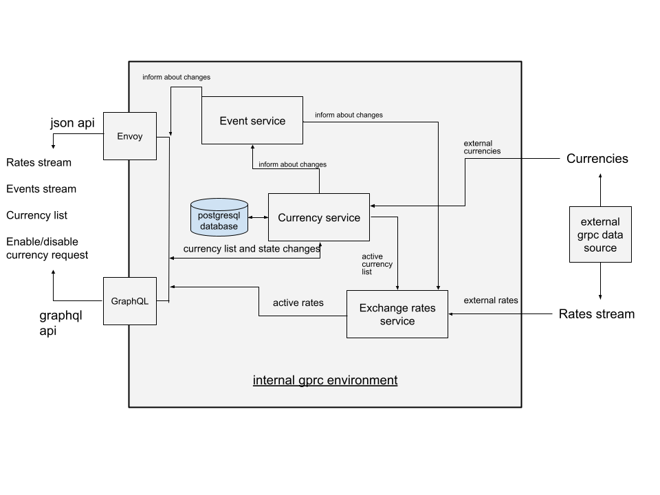

### Task description
To implement a currency exchange service, we need to provide the most actual current exchange quotes and currencies list. The list of currencies should contain all currencies that were available for exchange. If a currency stops being exchanged, then it is necessary to mark that as inactive. We must be able to independently disable the exchange for any currency. How and who will disable currencies from our side is not yet known, so we will choose the authorization method later. It will be good if the rate connection will not be interrupted when the list of currencies changes. So far, data needs to be sent via GraphQl and JSON API, but in the future, grpc-web API may be required.

To get the data, you should use the grpc API of the SuperFancy service. Authorization of requests by the API key which should be transmitted in headers. This service does not have a test environment, and access to documentation and technical support is possible only after signing the contract. They provided proto files that they sent to you in the mail.

By the time the contract is signed, it will be good to have a working service that will need a minimum of code improvements for the release.

### Package description

* Config package - hocon typesafe config provider.
* GrpcServer package - common implementation for grpc server.
* Proto package - proto building and grpc clients implementation.
* RateServer container - mock external data source with some data.
* CurrencyService - manage currencies, its states and inform on changes.
* ExchangeService - provides an exchange rate stream for active currencies.
* EventService - message service, which sends messages from publishers to listeners.
* GraphqlGateway - external graphQL api.
* EnvoyGateway - external json api.

### Diagram 

### How to build, run and stop

1. Build source
    1. in console [project directory]
        1. compile - ./gradlew assemble
        2. run tests - ./gradlew test
    2. or ide (idea)
        1. gradle root/tasks/build/assemble
        2. gradle root/tasks/verification/test
2. Build containers console [project directory]: ./docker-compose build
3. Run containers console [project directory]: ./docker-compose up
4. Remove containers console [project directory]: ./docker-compose down

### How to interact

* run containers
    * json api
        * get currencies: http://localhost:8080/currencies
        * get rates stream: http://localhost:8080/rates
        * get events stream: http://localhost:8080/events
        * disable/enable currency: curl --header "Content-Type: application/json" --request POST --data '{}' http://localhost:8080/toggle-disabled/usd
    * graphQL api
        * get currencies and disable/enable: http://localhost:8081/query.html
        * rates and events streams: http://localhost:8081/subscription.html
    